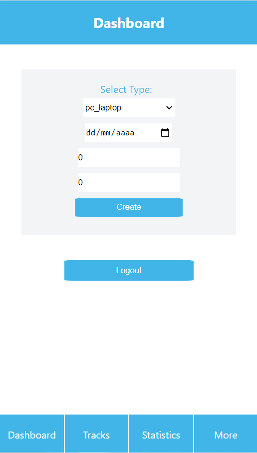

# Electric Consumption Tracker

> It is an application build in React which make request to an api and return data saved by each user

## Built With

- React
- Redux
- Javascript

## Live Demo

[Live Demo](https://julian-comsumption-tracker-app.herokuapp.com/)

## Getting Started

To get a local copy up and running follow these simple example steps.

### Setup

- Clone this repository. Type `git clone https://github.com/julian3493/capstone-tracking-app.git`
- Navigate to the project folder (capstone-tracking-app) `capstone-tracking-app`
- Change url `https://julian-comsumption-tracker-api.herokuapp.com` to `http://localhost:3001` in the following files:
 - Dashboard.js Line: 33
 - Login.js Line: 19
 - Logout.js Line: 13
 - Registrations.js Line: 21
 - Statistics.js Line: 46
 - TracksPage.js Line: 15
- Complete the set up for the api in this <a href="https://github.com/julian3493/capstone-tracking-app-api">repo</a>

### Run

Run the App locally using `npm start`

## Author
​
👤 **Julian Ramos**
​

[<code></code>](https://github.com/julian3493)
[<code></code>](https://twitter.com/JulianR16893833)
[<code></code>](https://www.linkedin.com/in/julian-ramos-arevalo/)
[<code></code>](mailto:julianramosarevalo@gmail.com)

## 🤝 Contributing

Contributions, issues and feature requests are welcome!

Feel free to check the <a href="https://github.com/julian3493/capstone-tracking-app/issues"> issues page</a>.

## Show your support

Give a ⭐️ if you like this project!